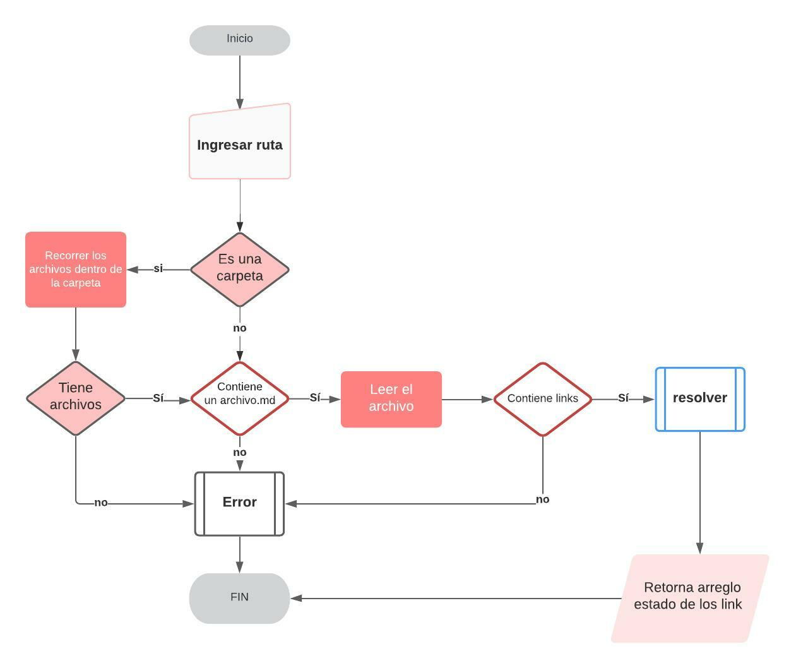

# Markdown Links

## Índice

* [1. Markdown Links](#1-Markdown-Links)
* [2. Instalacion](#2-Instalacion)
* [3. Guia de uso](#3-Instalacion)

***

## 1. Preámbulo
Markdown Links es una librería que extrae y valida los links de los archivos con formato .MD (markdown).


## 2. Instalación
Se necesita de instalación previa de Node.js. En el terminal colocar el siguiente comando:

npm i -g md-link-gabbyholics

## 3. Guia de Uso
 
# API 



mdLinkValidator(routeDirection, options)

### Argumentos
* path: Ruta absoluta o relativa al archivo o directorio.
* options: Un objeto con únicamente la siguiente propiedad:
    * validate: Booleano que determina si se desea validar los links encontrados.
# CLI
$ md-link-gabbyholics <path-to-file> [options]

### Options

### --validate
Si pasamos la opción --validate, el módulo hace una petición HTTP que averigua si el link funciona o no. Si el link resulta en una redirección a una URL que responde ok, entonces consideraremos el link como ok.

Por ejemplo:
````
$ md-link-validator ./some/example.md --validate
href: URL encontrada.
text: Texto que aparecía dentro del link (<a>).
file: Ruta del archivo donde se encontró el link.
status: Código de respuesta HTTP.
ok: Mensaje fail en caso de fallo u ok en caso de éxito.
````

